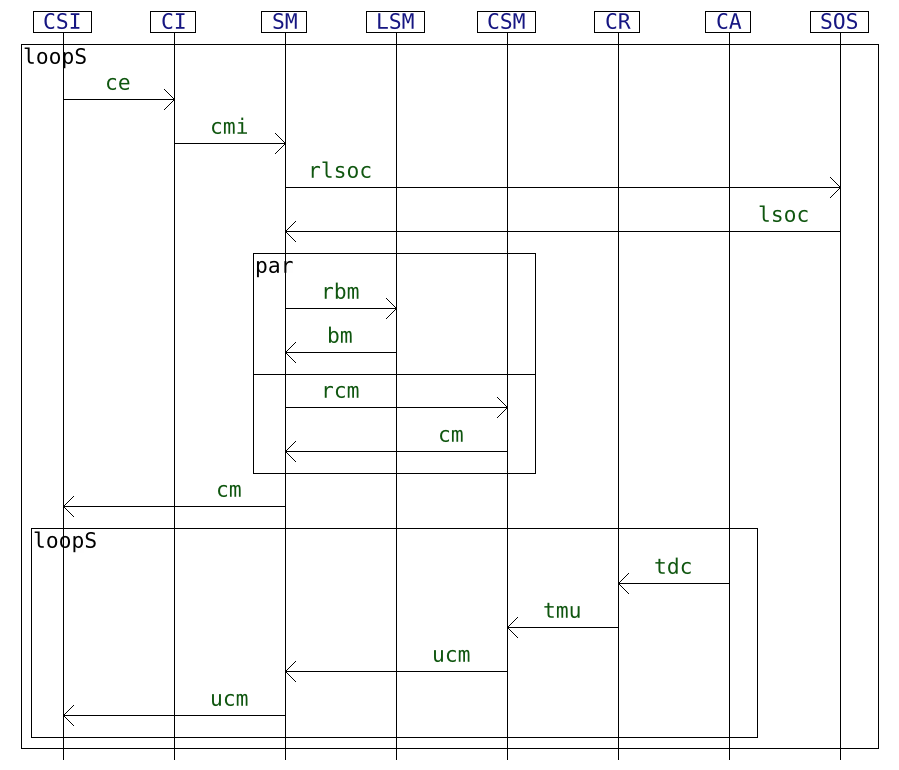
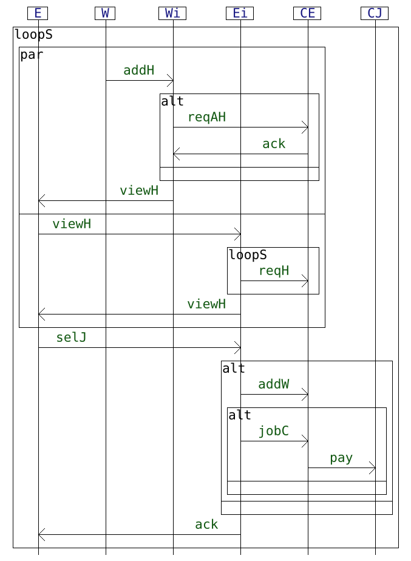

# A small experiment on the application of an incremental NFA synthesis algorithm for interactions on use cases from the literature

We apply the incremental method to NFA synthesis from interactions from [this paper](https://arxiv.org/abs/2306.02983) on a set of use cases from the literature.


## Input interaction models

We consider 4 interactions which formalize distributed systems specifications found in the literature:


| [A modelisaton of the Alternating Bit Protocol](https://satoss.uni.lu/members/sjouke/papers/MaRe97.pdf) | [A usecase on a system for querying sensor data](https://josis.org/index.php/josis/article/view/38) |
|---------------------------------------------------------------------------------------------------------|-----------------------------------------------------------------------------------------------------|
|                                           |                                      | 


| [A protocol for managing a platoon of autonomous vehicles](https://www.sparta.eu/assets/deliverables/SPARTA-D5.1-Assessment-specifications-and-roadmap-PU-M12.pdf) | [A protocol using smart contracts for human resources management](https://ceur-ws.org/Vol-2580/DLT_2020_paper_8.pdf) |
|------------------------------------------------------------------------------------------------------------------|----------------------------------------------------------------------------------------------------|
|                                                   |                                   |


## Metrics

We obtain the following metrics:


| use case | INT num lifelines | INT depth | INT loop depth | INT num acts | NFA num states | NFA num transitions | NFA median time  | min DFA num states | min DFA num transitions |
| ---------|-------------------|-----------|----------------|--------------|----------------|---------------------|------------------|--------------------|-------------------------| 
|   ABP    | 4                 | 21        | 2              | 60           | 68             | 94                  | 8100 micro secs  | 64                 | 90                      |
|   HR     | 6                 | 9         | 2              | 24           | 101            | 214                 | 7450 micro secs  | 102                | 215                     |
| Platoon  | 3                 | 9         | 2              | 17           | 90             | 189                 | 3100 micro secs  | 90                 | 189                     |
| Sensor   | 12                | 12        | 2              | 26           | 168            | 368                 | 14800 micro secs | 171                | 373                     |


## Running the experiment:

### To draw the interactions

```
.\hibou_label.exe draw .\model\abp.hsf .\model\abp.hif

.\hibou_label.exe draw .\model\hr.hsf .\model\hr.hif

.\hibou_label.exe draw .\model\platoon.hsf .\model\platoon.hif

.\hibou_label.exe draw .\model\sensor.hsf .\model\sensor.hif
```

### To extract the various metrics

Likewise, given `x` either of `abp`, `hr`, `platoon` or `sensor`:

To get the interaction's metrics:
```
.\hibou_label.exe get_metrics .\model\X.hsf .\model\X.hif INT
```

To get the NFA's metrics:
```
.\hibou_label.exe get_metrics .\model\X.hsf .\model\X.hif operatNFA
```


To get the DFA's metrics:
```
.\hibou_label.exe get_metrics .\model\X.hsf .\model\X.hif minDFA
```