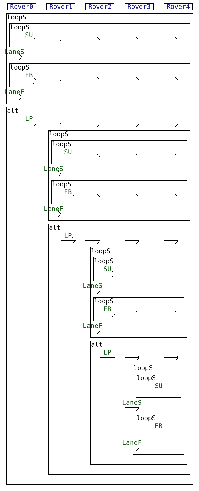

# A small experiment on the application of an incremental NFA synthesis algorithm for interactions on use cases from the literature

We apply the incremental method to NFA synthesis from interactions from [this paper](https://arxiv.org/abs/2306.02983) on a set of use cases from the literature.


## Input interaction models

We consider 3 interactions which formalize distributed systems specifications found in the literature:


| [A modelisaton of the Alternating Bit Protocol](https://satoss.uni.lu/members/sjouke/papers/MaRe97.pdf) | [A usecase on a system for querying sensor data](https://josis.org/index.php/josis/article/view/38) |
|---------------------------------------------------------------------------------------------------------|-----------------------------------------------------------------------------------------------------|
|                                           |                                 | 


| [A protocol using smart contracts for human resources management](https://ceur-ws.org/Vol-2580/DLT_2020_paper_8.pdf) |
|----------------------------------------------------------------------------------------------------------------------|
|                                                          |


Additionally, we consider a set of interactions which are variants on an example using [A protocol for managing a platoon of autonomous vehicles](https://www.sparta.eu/assets/deliverables/SPARTA-D5.1-Assessment-specifications-and-roadmap-PU-M12.pdf).

| 3 Rovers                                                     | 4 Rovers                                                     | 5 Rovers                                                     |
|--------------------------------------------------------------|--------------------------------------------------------------|--------------------------------------------------------------|
|  |  |  |


You can generate these interactions via the genRovers.py Python script.


## Metrics

We obtain the following metrics:


| use case | INT num lifelines | INT depth | INT loop depth | INT num acts | NFA num states | NFA num transitions | NFA median time      | min DFA num states | min DFA num transitions |
| ---------|-------------------|-----------|----------------|--------------|----------------|---------------------|----------------------|--------------------|-------------------------| 
|   ABP    | 4                 | 21        | 2              | 60           | 68             | 94                  | 8 100 micro secs     | 64                 | 90                      |
|   HR     | 6                 | 9         | 2              | 24           | 101            | 214                 | 7 450 micro secs     | 102                | 215                     |
| Sensor   | 12                | 12        | 2              | 26           | 168            | 368                 | 14 800 micro secs    | 171                | 373                     |
| Platoon2 | 2                 | 6         | 2              | 6            | 10             | 18                  | 280 micro secs       | 10                 | 18                      |
| Platoon3 | 3                 | 9         | 2              | 17           | 90             | 189                 | 3 100 micro secs     | 90                 | 189                     |
| Platoon4 | 4                 | 12        | 2              | 31           | 752            | 1874                | 57 500 micro secs    | 752                | 1874                    |
| Platoon5 | 5                 | 15        | 2              | 48           | 6440           | 18855               | 2 338 000 micro secs | 6440               | 18855                   |


With these examples, the generated NFA have numbers of states and transitions comparable to that of equivalent minimal DFAs.
Yet, there are cases where DFAs have exponentially more states than their NFA counterparts.
See [here](https://github.com/erwanM974/hibou_nfa_generation) for such examples applied to NFA synthesis from interactions.


## Running the experiment:

(Re)generate the platoons models via :

```
pyton genRovers.py
```

### To draw the interactions

Likewise, given `X` either of `.\model\abp`, `.\model\hr`, `.\model\sensor` or any `.\genmodel\platoonI` (with I an integer) :

Use the following to generate the sequence diagrammatic representation of the model :
```
.\hibou_label.exe draw X.hsf X.hif
```

Use the following to extract the interaction's metrics :
```
.\hibou_label.exe get_metrics X.hsf X.hif INT
```


Use the following to extract some metrics on the NFA generated using our iterative/incremental synthesis method :
```
.\hibou_label.exe get_metrics X.hsf X.hif operatNFA
```


And the following to have metrics on a minimal equivalent DFA
(see [here](https://github.com/erwanM974/hibou_nfa_generation) for examples where the minimal DFA has exponentially more states that its NFA counterpart) :
```
.\hibou_label.exe get_metrics X.hsf X.hif minDFA
```